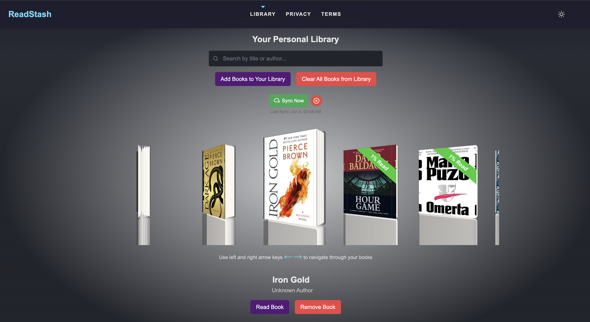

# Bitabo E-book Reader

A client-side e-book reader and library manager built with SvelteKit. Bitabo allows users to store and read their e-books directly in the browser with no content uploaded to any server.



## Features

- **Modern E-book Library Management**: Organize and browse your e-books in a visually appealing interface
- **Multi-format Support**: Read EPUB, PDF, MOBI, and AZW3 files
- **Client-side Processing**: All files stay on your device, keeping your library private
- **Responsive Design**: Works across desktop and mobile devices
- **Dark Mode Support**: Choose between light and dark themes
- **Google Drive Integration**: Import books directly from your Google Drive
- **Progressive Web App (PWA)**: Install on your device for offline access
- **Search Functionality**: Quickly find books by title or author
- **Book Metadata Editing**: Edit titles and authors

## Current Status

Bitabo is currently in active development and ready for testing. The core functionality is working:

- ✅ Book library management
- ✅ E-book reader for supported formats
- ✅ Book metadata extraction and management
- ✅ Responsive UI with empty state handling
- ✅ Search functionality
- ✅ Google Drive integration
- ✅ PWA support for offline reading

## Getting Started

### Local Development

1. Clone the repository
2. Install dependencies:
   ```bash
   npm install
   ```
3. Start the development server:
   ```bash
   npm run dev
   ```
4. Open your browser to the URL shown in the terminal (usually http://localhost:5173/)

### Using the Application

1. Upload your e-books using the "Upload Your Books" button
2. Browse your library using the coverflow interface
3. Click on a book to read it
4. Use the search bar to find specific books

## Building for Production

To create a production build:

```bash
npm run build
```

You can preview the production build with:

```bash
npm run preview
```

## Technologies Used

- [SvelteKit](https://kit.svelte.dev/) - Frontend framework
- [Tailwind CSS](https://tailwindcss.com/) - Styling
- [IndexedDB](https://developer.mozilla.org/en-US/docs/Web/API/IndexedDB_API) - Client-side storage
- [Foliate-js](https://github.com/johnfactotum/foliate-js) - E-book rendering (modified)
- [Service Workers](https://developer.mozilla.org/en-US/docs/Web/API/Service_Worker_API) - Offline functionality

## License

[MIT License](LICENSE)